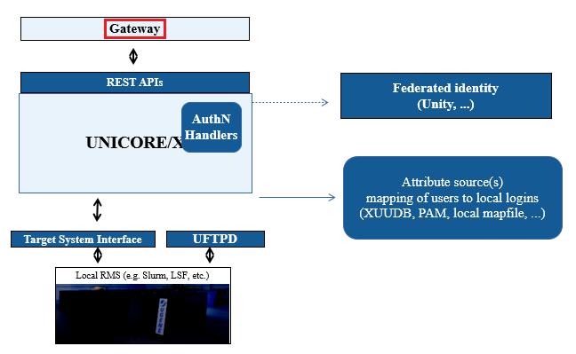

.. _gateway:

Gateway
*******

The UNICORE Gateway is an (optional) server component that
provides a reverse https proxy, allowing you to run several backend
servers (:ref:`unicorex`, :ref:`registry`, ...) behind a single address.
This helps with firewall configuration, requiring only a **single open port** 
(a similar effect can be achieved using other http servers that can
act as a reverse proxy, such as `Apache httpd <https://httpd.apache.org/>`_ 
or `nginx <https://nginx.org>`_).

The second functionality of the Gateway is (optional) authentication
of incoming requests. Connections to the Gateway are made using SSL,
so the Gateway can be configured to check whether the caller presents
a certificate issued by a trusted authority. Information about the
client is forwarded to services behind the Gateway in UNICORE
proprietary format (as a HTTP header).

The Gateway will forward the IP address of the client to the back-end
server.

Last not least, the Gateway can be configured as a HTTP load balancer.

  
  UNICORE Gateway Server

|user-guide-img| :doc:`gw-manual`
  Installation and Operating the Gateway.

.. |user-guide-img| image:: ../../_static/user-guide.png
	:height: 22px
	:align: middle

.. toctree::
	:maxdepth: 5
	:caption: Gateway Documentation
	:hidden:
	
	gw-manual
	
.. toctree::
	:maxdepth: 1
	:hidden:

.. raw:: html

   

