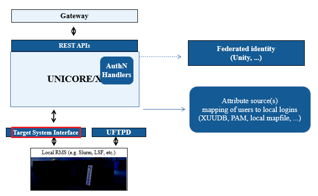

.. _tsi:

TSI
***

The UNICORE **T**\ arget **S**\ ystem **I**\ nterface (TSI) is used by the 
:ref:`UNICORE/X server <unicorex>` to perform tasks
on the target resource, such as submitting and monitoring jobs,
handling data, managing directories etc. It is a daemon running on the frontend of the target
resource (e.g. a cluster login node) which provides a remote interface
to the operating system, the batch system and the file system of the
target resource.

The TSI will run as ``root`` on the cluster login node(s).
It requires an open port (default: ``4433``) where it receives connections
from the UNICORE/X server(s). The TSI will make outgoing connections
(callbacks) to the UNICORE/X server(s). Please set up your firewall(s)
accordingly. Operation through an SSH tunnel is possible as well, see
the :ref:`tsi-manual` for details.

  
  UNICORE TSI

.. topic:: Documentation for TSI

  :doc:`manual`
      User Manual with detailed instructions and examples for using the TSI.

  :doc:`api`
      The API to the TSI as used by :ref:`UNICORE/X <unicorex>`.

  :doc:`building`
      Building the TSI distribution packages.

  :doc:`changelog`
    The TSI changelog.

	
	
.. toctree::
	:maxdepth: 5
	:caption: TSI Documentation
	:hidden:
	
	manual
	api
	building

.. toctree::
	:maxdepth: 1
	:hidden:
	
	changelog

