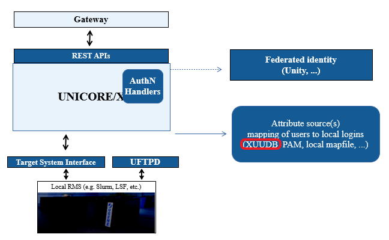

.. _xuudb:

XUUDB
*****

The UNICORE XUUDB is a service acting as an *attribute source* as part
of a UNICORE installation. It is an optional service, that is best
suited as a per-site service, providing attributes for multiple
:ref:`UNICORE/X <unicorex>`-like services at a site.

The XUUDB maps a UNICORE user identity (which is formally an X.500
**d**\ istinguished **n**\ ame (**DN**)) to a set of attributes. The attributes are
typically used to provide local account details (uid, gid(s)) and
commonly also to provide authorization information, i.e. the
user's role.

  
  UNICORE XUUDB

:doc:`manual`
      User Manual with detailed instructions and examples for using the XUUDB.

.. toctree::
	:maxdepth: 5
	:caption: XUUDB Documentation
	:hidden:
      
	manual
	
