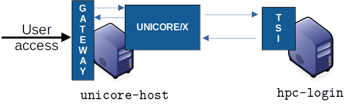

.. _unicore-howto-singlecluster:

|user-guide| How to setup UNICORE for a single HPC cluster
**********************************************************

.. |user-guide| image:: _static/user-guide.png
	:height: 32px
	:align: middle

|overview-img| Overview
-----------------------

This How-To covers in detail the steps required to install a minimal set
of UNICORE services for a single HPC cluster that is running Slurm.

The following steps will be described:

 - setup the Slurm TSI on a HPC login node
 - deploy UNICORE Gateway and UNICORE/X on one VM or physical server
 - connect UNICORE/X and TSI
 - add test user(s)
 - make a Slurm queue accessible via UNICORE
 - test the installation via ``curl``
 - replace the *demo* certificate by a more secure self-signed
   certificate for Gateway and UNICORE/X
 

   
   Example deployment for a single cluster

|checklist-img| Prerequisites
-----------------------------

- a server or VM with Java 11 or later and Python3 installed

- port ``8080`` on this server must be accessible from the Internet if you want to
  let external users access your cluster.

In the following, we will refer to this machine as ``unicore-host``. 
Adapt the following code examples according to your actual machine name.

- access to the HPC login node(s) with Python3 installed. Since UNICORE requires
  a TCP connection from the ``unicore-host`` to the login node(s), and another
  TCP connection from the login node(s) to the ``unicore-host``, the local firewall
  rules might need to be adapted accordingly. Details will be given below.

|installer-img| Installing the TSI
----------------------------------

.. |installer-img| image:: _static/installer.png
	:height: 32px
	:align: middle

The TSI is a server daemon written in Python and is installed on (one or more)
HPC login nodes.

The HPC login node will be named ``hpc-login`` in the following.

Preparations
~~~~~~~~~~~~

 - SSH as ``root`` into the login node:

 - Add a ``unicore`` user and a directory for the UNICORE TSI:

.. code:: console

  /usr/sbin/groupadd -r unicore  
  /usr/sbin/useradd -c "UNICORE" -g unicore -s /bin/false -r -d /tmp unicore
  mkdir -p /opt/unicore
  chown unicore:unicore /opt/unicore

Download and install the Slurm TSI
~~~~~~~~~~~~~~~~~~~~~~~~~~~~~~~~~~

.. code:: console

  cd /opt/unicore

  wget https://sourceforge.net/projects/unicore/files/Servers/Core/9.3.1/unicore-tsi-9.3.1.tgz -O unicore-tsi-9.3.1.tgz
  
  tar xf unicore-tsi-9.3.1.tgz
  rm unicore-tsi-9.3.1.tgz
  cd unicore-tsi-9.3.1
  
  ./Install.sh slurm /opt/unicore/tsi
  
  chown -R unicore:unicore /opt/unicore/tsi
  
  cd /opt/unicore/tsi/conf
  
  # log to file in /opt/unicore/tsi/logs/ instead of syslog
  sed -i "s/use_syslog=.*/use_syslog=0/" tsi.properties

  # configure the hostname of the UNICORE/X machine
  sed -i "s/unicorex_machine=.*/unicorex_machine=unicore-host/" tsi.properties

You can start the TSI now and see if there are any errors in the log file:

.. code:: console

  rm -f /opt/unicore/tsi/logs/*
  /opt/unicore/tsi/bin/start.sh
  cat /opt/unicore/tsi/logs/TSILog_*

|installer-img| Installing the UNICORE Gateway and UNICORE/X
------------------------------------------------------------

The two Java-based server components will be installed on the host named ``unicore-host``.
We assume that Java 11 or later is installed.

Check that 

.. code:: console

  java --version
  
works and shows the correct version.

After this step, the UNICORE installation will be accessible at

``https://unicore-host:8080/TEST/rest/core``.

Preparations
~~~~~~~~~~~~

 - SSH into ``unicore-host``

 - Add a ``unicore`` user and a directory for the UNICORE components:

.. code:: console

  /usr/sbin/groupadd -r unicore  
  /usr/sbin/useradd -c "UNICORE" -g unicore -s /bin/false -r -d /tmp unicore
  mkdir -p /opt/unicore
  chown unicore:unicore /opt/unicore

Download and extract the UNICORE Server bundle
~~~~~~~~~~~~~~~~~~~~~~~~~~~~~~~~~~~~~~~~~~~~~~

.. code:: console

  cd /opt/unicore

  wget https://sourceforge.net/projects/unicore/files/Servers/Core/9.3.1/unicore-servers-9.3.1.tgz -O unicore-servers-9.3.1.tgz
  
  tar xf unicore-servers-9.3.1.tgz
  chown -R unicore:unicore unicore-servers-9.3.1
  rm unicore-servers-9.3.1.tgz

Installing UNICORE Gateway and UNICORE/X
~~~~~~~~~~~~~~~~~~~~~~~~~~~~~~~~~~~~~~~~

We will install the Gateway to ``/opt/unicore/gateway`` and UNICORE/X to
``/opt/unicore/unicorex`` using the `configure.py` and `install.py` scripts.

Here we can already set the TSI host (``hpc-login``) and configure the Gateway to
listen on all addresses and route requests to UNICORE/X under the *TEST* alias.

We also tell UNICORE/X what the public hostname of the UNICORE installation
will be (``unicore-host``) and where the job directories should be created
on the HPC cluster.

.. code:: console

  cd unicore-servers-9.3.1

  # TSI is running on 'hpc-login'
  sed -i "s/uxTSIHost=.*/uxTSIHost=hpc-login/" configure.properties

  # Public address is 'unicore-host'
  sed -i "s/uxGatewayHost=.*/uxGatewayHost=unicore-host/" configure.properties

  sed -i "s/uxName=.*/uxName=TEST/" configure.properties
  
  sed -i 's%uxTSIWorkingDirectoriesBasedir=.*%uxTSIWorkingDirectoriesBasedir=$HOME/UNICORE_Jobs%' configure.properties
  
  sed -i "s/tsi=true/tsi=false/" configure.properties

  sed -i "s/gwHost=.*/gwHost=0.0.0.0/" configure.properties

  sed -i "s%INSTALL_PATH=currentdir%INSTALL_PATH=/opt/unicore%" configure.properties

  # setup the configuration files and copy the required files to '/opt/unicore'
  
  sudo -u unicore ./configure.py
  sudo -u unicore ./install.py
  

Starting the Gateway
~~~~~~~~~~~~~~~~~~~~

The Gateway files can now be found in ``/opt/unicore/gateway`` and the server
is started like this:

.. code:: console

  cd /opt/unicore/gateway

  sudo -u unicore bin/start.sh

Logs are in ``/opt/unicore/gateway/logs``.

To check for any errors:

.. code:: console

  cat /opt/unicore/gateway/logs/gateway.log | grep ERROR

The Gateway should now be accessible. A simple test using ``curl`` would be:

.. code:: console

  curl -k -i https://unicore-host:8080
  
(which will return some HTML)

|config-img| UNICORE/X configuration
------------------------------------

.. |config-img| image:: _static/configuration.png
	:height: 32px
	:align: middle

The UNICORE/X files are now in ``/opt/unicore/unicorex``.

UNICORE/X is the central component in a UNICORE installation, and consequently has quite a
few configuration options.

Here we focus on a very basic setup, and refer to the :ref:`full manual <unicorex-manual>` 
for more information.

Connecting UNICORE/X and TSI
~~~~~~~~~~~~~~~~~~~~~~~~~~~~

This part is configured in the file ``/opt/unicore/unicorex/conf/tsi.config``.

UNICORE/X and TSI communicate via TCP. There are two connections:

1. From the UNICORE/X host to the TSI (HPC login node) on port ``4433``
2. From the HPC login node to the UNICORE/X host on port ``7654``

Make sure your firewall(s) allow both these connections.

Starting UNICORE/X
~~~~~~~~~~~~~~~~~~

The UNICORE/X server is started like this:

.. code:: console

  cd /opt/unicore/unicorex

  sudo -u unicore bin/start.sh

Logs are in ``/opt/unicore/unicorex/logs``.

To check for any errors:

.. code:: console

  cat /opt/unicore/unicorex/logs/startup.log | grep ERROR
  cat /opt/unicore/unicorex/logs/unicorex.log | grep ERROR

As a first check via the REST API, you can run

.. code:: console

  curl -k -H "Accept: application/json" https://unicore-host:8080/TEST/rest/core | python3 -m json.tool

User authentication
~~~~~~~~~~~~~~~~~~~

To understand the security concepts in UNICORE, please read :ref:`this section <ux_security_concepts>`
in the UNICORE/X manual.

In the configuration we have set up so far, UNICORE will authenticate users via username/password, which
are configured in a file 

``/opt/unicore/unicorex/conf/rest-users.txt``

A default user *demouser* with password *test123* is pre-configured, you can add others.

Many other options for authentication exist, and we can only refer to the :ref:`Authentication section <use_auth>`
in the UNICORE/X manual.

User account mapping
~~~~~~~~~~~~~~~~~~~~

In the configuration we have set up so far, users are mapped to HPC accounts in the file

``/opt/unicore/unicorex/conf/simpleuudb``

Make sure to add account mappings for your users there.

Other options for account mapping exist, we refer to the :ref:`Attribute sources section <use_aip>`
in the UNICORE/X manual.

Setting up batch queues
~~~~~~~~~~~~~~~~~~~~~~~

The available batch system queues are configured in the file

``/opt/unicore/unicorex/conf/idb.json``

A partition named ``batch`` is already in there, make sure to have a look and adapt it to your needs.

For more information, we refer to the :ref:`IDB syntax section <ux_idb_syntax>`
in the UNICORE/X manual.

|testing-img| Testing
---------------------

Authentication and user mapping
~~~~~~~~~~~~~~~~~~~~~~~~~~~~~~~

To check that the authentication and user mapping works as intended, you can run the following

.. code:: console

  export BASE=https://unicore-host:8080/TEST/rest/core

  curl -k -u demouser:test123 -H "Accept: application/json" $BASE?fields=client | python3 -m json.tool

where the output will look approximately like this

.. code:: json

  {
    "client": {
        "role": {
            "selected": "user",
            "availableRoles": [
                "user"
            ]
        },
        "authenticationMethod": "PASSWORD_FILE",
        "dn": "CN=Demo User, O=UNICORE, C=EU",
        "xlogin": {
            "UID": "demouser",
            "availableGroups": [],
            "availableUIDs": [
                "demouser"
            ]
        }
    }
  }

Batch queue setup
~~~~~~~~~~~~~~~~~

To check the available batch queues,

.. code:: console

  export BASE=https://unicore-host:8080/TEST/rest/core

  curl -k -H "Accept: application/json" $BASE/factories/default_target_system_factory?fields=resources | python3 -m json.tool

which will look similar to this

.. code:: json

  {
    "resources": {
        "batch": {
            "CPUsPerNode": "1-4",
            "Runtime": "10-86000",
            "MemoryPerNode": "1048576-1073741824",
            "Nodes": "1-16",
            "TotalCPUs": "1-64"
        }
    }
  }

Test job
~~~~~~~~

Create a file *test1.json* with the following content

.. code:: json

  {
    "Executable": "date"
  }

and submit it using

.. code:: console

  export BASE=https://unicore-host:8080/TEST/rest/core

  curl -k -i -u demouser:test123 -H "Content-Type: application/json" --data-ascii @test1.json  $BASE/jobs

which should result in something like this

.. code::

  HTTP/1.1 201 Created
  Date: Tue, 04 Jul 2023 09:59:38 GMT
  X-Frame-Options: DENY
  Content-Type: application/json;charset=utf-8
  X-UNICORE-SecuritySession: 192ae773-650b-45bf-93fb-5552739f5460
  X-UNICORE-SecuritySession-Lifetime: 28799354
  Location: https://unicore-host:8080/TEST/rest/core/jobs/78b1a586-3f66-4f5b-bb8d-7fe1d8fe7b87
  Transfer-Encoding: chunked

Check the UNICORE/X logs in case of errors. To check whether the job runs properly, check the logs.
You can also access the job via the REST API, the URL to use is given in the ``Location`` field above

.. code:: console

  export JOB=https://unicore-host:8080/TEST/rest/core/jobs/78b1a586-3f66-4f5b-bb8d-7fe1d8fe7b87

  curl -k -u demouser:test123 -H "Accept: application/json" $JOB | python3 -m json.tool

Further testing
~~~~~~~~~~~~~~~

We recommend downloading the :ref:`UNICORE commandline client<ucc>`, or using
`PyUNICORE <https://pyunicore.readthedocs.io/>`_ for further tests.

|certificate-img| Server certificate
------------------------------------

Up to now, the so-called *demo certificates* that come with the download have been used.
While this is OK for testing and setup, it is VERY BAD to expose such a server to the outside world,
since anyone who knows what they are doing can easily get access to your installation.

Ideally you will get an SSL certificate from a **CA** (**C**\ ertification **A**\ uthority) for your machine and
use that. It's however beyond the scope of this how-to to give a full introduction to SSL certificates.

As an improvement over the demo certificates, we will create a so-called *self-signed
certificate* and use that, which is secure enough to expose the system to outside users, but is usually
not good enough when integrating UNICORE access with external applications, or integrating your
UNICORE installation into a bigger setup or federation.

Generating the self-signed certificate
~~~~~~~~~~~~~~~~~~~~~~~~~~~~~~~~~~~~~~

The following uses OpenSSL to create a self-signed certificate

.. code:: console

  cd /opt/unicore/certs

  openssl req -x509 -newkey rsa:4096 -sha256 -nodes -days 3650 \
      -keyout server-key.pem   \
      -out server-cert.pem     \
      -subj "/C=EU/O=Test/CN=unicore-host"

  chown unicore:unicore server-*.pem
  
  cat server-cert.pem >> server-key.pem

The file `server-key.pem` is now suitable as server credential, and the `server-cert.pem` 
will be used as the server truststore. We will use the same key and cert for
both UNICORE/X and Gateway.

Gateway config
~~~~~~~~~~~~~~

We configure our new credential and trusted certificate in the 
file `/opt/unicore/gateway/conf/gateway.properties`:

.. code:: console

  cd /opt/unicore/gateway/conf

  sed -i "s%credential.path=.*%credential.path=/opt/unicore/certs/server-key.pem%" gateway.properties
  sed -i "s%credential.password=.*%credential.password=%" gateway.properties

  sed -i "s%directoryLocations.1=.*%directoryLocations.1=/opt/unicore/certs/server-cert.pem%" gateway.properties 

Restart via:

.. code:: console

  cd /opt/unicore/gateway
  bin/stop.sh
  sudo -u unicore bin/start.sh
  
Check the logs for any errors!

UNICORE/X config
~~~~~~~~~~~~~~~~

We configure our new credential and trusted certificate in the 
file `/opt/unicore/unicorex/conf/container.properties`:

.. code:: console

  cd /opt/unicore/unicorex/conf

  sed -i "s%credential.path=.*%credential.path=/opt/unicore/certs/server-key.pem%" container.properties
  sed -i "s%credential.password=.*%credential.password=%" container.properties

  sed -i "s%directoryLocations.1=.*%directoryLocations.1=/opt/unicore/certs/server-cert.pem%" container.properties 

Restart via:

.. code:: console

  cd /opt/unicore/unicorex
  bin/stop.sh
  sudo -u unicore bin/start.sh
  
Check the logs for any errors!

|support-img| Getting support
-----------------------------

.. |support-img| image:: _static/support.png
	:height: 32px
	:align: middle

You can always :ref:`contact us<support>` for advice in your specific situation.
