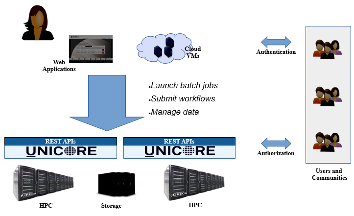

.. _unicore-docs:

Welcome to UNICORE Documentation
================================

.. role:: blue

`UNICORE <https://www.unicore.eu>`_ (:blue:`UN`\ iform :blue:`I`\ nterface to :blue:`CO`\ mputing 
:blue:`RE`\ sources) offers a ready-to-run system including client and server software. 
It makes distributed computing and data resources available in a seamless and secure way 
in intranets and the internet. 

   
   Federating HPC with UNICORE
   

* :ref:`unicore-overview` gives an overview of the UNICORE features and the UNICORE architecture
* :ref:`unicore-gettingstarted` shows how to get going quickly
* :ref:`unicore-howto-singlecluster` covers the steps required to install a minimal set of UNICORE services 
  for a single HPC cluster that is running Slurm

.. toctree::
	:maxdepth: 5
	:caption: UNICORE Documentation
	:hidden:
	
	overview
	gettingstarted

	howto-singlecluster

.. include:: user-docs/index.rest
.. include:: admin-docs/index.rest

|support-img| Getting Support
=============================

For more information, please see the :ref:`links` and :ref:`support` page.

.. toctree::
	:caption: Getting Support
	:hidden:
	
	links.rst
	support

|bsd-img| License
=================

UNICORE software is available as Open Source under the :ref:`BSD License <license>` 
while the software repository is hosted on `SourceForge <https://sourceforge.net/projects/unicore/>`_
and the source code is available on `GitHub <https://github.com/UNICORE-EU>`_. 

.. toctree::
	:caption: LICENSE
	:hidden:
	
	license

