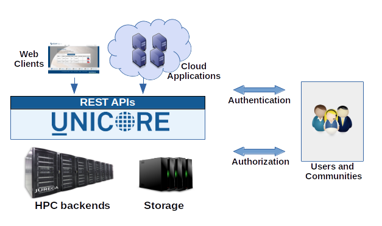

.. _unicore-docs:

Welcome to UNICORE Documentation
================================

.. meta::
   :description: The UNICORE documentation
   :keywords: UNICORE, documentation

.. role:: blue

`UNICORE <https://www.unicore.eu>`_ (:blue:`UN`\ iform :blue:`I`\ nterface to :blue:`CO`\ mputing 
:blue:`RE`\ sources) offers a ready-to-run system including client and server software. 
It makes distributed computing and data resources available in a seamless and secure way 
in intranets and the internet. 

   
   Federating HPC with UNICORE
   

|overview-img| :ref:`unicore-overview`
	gives an overview of the UNICORE features and the UNICORE architecture.

|start-img| :ref:`unicore-gettingstarted`
	shows how to get going quickly.

|user-guide-img| :ref:`unicore-howto-singlecluster`
	covers the steps required to install a minimal set of UNICORE services 
	for a single HPC cluster that is running Slurm.

.. |overview-img| image:: _static/overview.png
	:height: 24px
	:align: middle

.. |start-img| image:: _static/start.png
	:height: 24px
	:align: middle

.. |user-guide-img| image:: _static/user-guide.png
	:height: 24px
	:align: middle

.. toctree::
	:maxdepth: 5
	:caption: UNICORE Documentation
	:hidden:
	
	overview
	gettingstarted

	howto-singlecluster

.. raw:: html

   

.. include:: user-docs/index.rest
.. include:: admin-docs/index.rest

|support-img| Getting Support
=============================

.. |support-img| image:: _static/support.png
	:height: 32px
	:align: middle

UNICORE software is available as Open Source under the :ref:`BSD License <license>` 
while the software repository is hosted on `SourceForge <https://sourceforge.net/projects/unicore/>`_
and the source code is available on `GitHub <https://github.com/UNICORE-EU>`_. 

For getting more information or support, please see the :ref:`links` and :ref:`support` page.
The :ref:`glossary` includes a number of terms that we use in our documentation, so that you have a reference 
for how we’re using them.

.. toctree::
	:caption: Getting Support
	:hidden:
	
	license
	links
	support
	glossary

.. raw:: html

   

