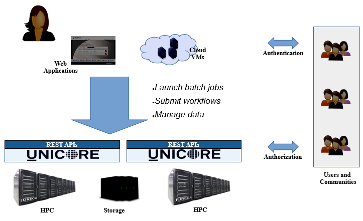
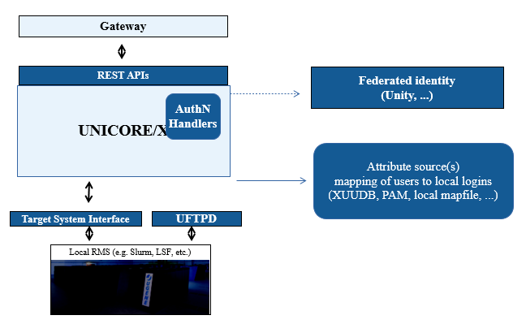

.. _unicore-overview:

Overview
********

UNICORE (UNiform Interface to COmputing REsources) provides tools and
services for building federated systems, making high-performance
computing and data resources accessible in a seamless and secure way
for a wide variety of applications in intranets and the internet.

UNICORE Features
----------------

UNICORE has special characteristics that make it unique among middleware systems. 
UNICORE deals with authentication, user mapping and authorization, 
and provides a comprehensive set of :ref:`RESTful APIs <rest-api>` for HPC access and workflows.
The UNICORE design is based on several guiding principles, that serve as key objectives 
for further enhancements. 

Services and APIs
~~~~~~~~~~~~~~~~~

    * Batch jobs with pre- and postprocessing
    * Support for common resource managers such as SLURM or LoadLeveler
    * File system access and file transfer
    * Site-to-site file transfer
    * Cross-site workflows featuring graphs, loops, conditions, variables, hold/continue, workflow 
      data management
    * Metadata
    * Service Registry

Security
~~~~~~~~

    * Flexible user authentication: username/password, OpenID Connect, X\.509, ...
    * Flexible mapping of users to local accounts and groups
    * Based on open standards: X\.509 Public Key Infrastructure, TLS, SAML, OIDC, XACML, ...

Clients
~~~~~~~

    * :ref:`Commandline client <ucc>`: Job execution, data transfer, workflows, scripting, batch mode, extensible
    * Dedicated `client for the UFTP 
      <https://uftp-docs.readthedocs.io/en/latest/user-docs/uftp-client/>`_ 
      high performance file transfer 
    * `pyUNICORE <https://github.com/HumanBrainProject/pyunicore/>`_ Python client library

Add-ons
~~~~~~~

    * `Standalone UFTP suite <https://uftp-docs.readthedocs.io/en/latest>`_ for high-performance data transfer 
      (can be used independently of UNICORE)
    * `Unity Identity Management system <https://unity-idm.eu>`_, supports LDAP, OAuth, SAML, 
      federated AAI and a lot more

UNICORE Architecture
--------------------

The architecture of UNICORE is three-layered in client layer, service layer and 
target system layer as shown in the figure below. 

