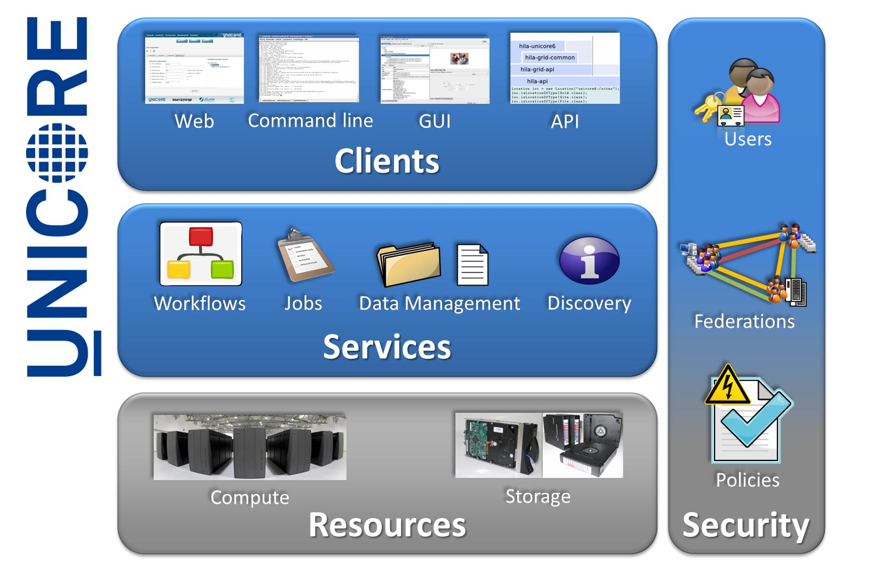

.. _unicore-overview:

Overview
********

UNICORE (UNiform Interface to COmputing REsources) provides tools and
services for building federated systems, making high-performance
computing and data resources accessible in a seamless and secure way
for a wide variety of applications in intranets and the internet.

UNICORE deals with user authentication, account mapping and authorization, 
and provides a comprehensive set of RESTful APIs for HPC access and workflows.

UNICORE Features
----------------

.. topic:: Services and APIs

    * Batch jobs with pre- and postprocessing
    * Support for common resource managers such as SLURM or LoadLeveler
    * File system access and file transfer
    * Site-to-site file transfer
    * Cross-site workflows featuring graphs, loops, conditions, variables, hold/continue, workflow data management
    * Metadata
    * Service Registry

.. topic:: Security

    * Flexible user authentication: username/password, OpenID Connect, X\.509, ...
    * Flexible mapping of users to local accounts and groups
    * Based on open standards: X\.509 Public Key Infrastructure, TLS, SAML, OIDC, XACML, ...

.. topic:: Clients

    * `Commandline client <ucc>`_: Job execution, data transfer, workflows, scripting, batch mode, extensible
    * Dedicated `client for the UFTP high performance file transfer <https://uftp-docs.readthedocs.io/en/latest/uftp-client/>`_
    * `pyUNICORE <https://github.com/HumanBrainProject/pyunicore/>`_ Python client library

.. topic:: Add-ons

    * `Standalone UFTP suite <https://uftp-docs.readthedocs.io/>`_ for high-performance data transfer (can be used independently of UNICORE)
    * `Unity Identity Management system <https://unity-idm.eu>`_, supports LDAP, OAuth, SAML, federated AAI and a lot more

UNICORE Architecture
--------------------

The architecture of UNICORE is three-layered in client layer, service layer and 
target system layer as shown in the figure below. 

