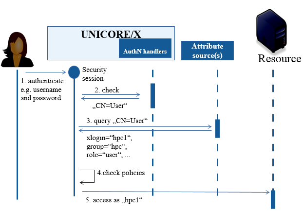

.. _unicorex:

UNICORE/X
*********

UNICORE/X is the central component of a typical UNICORE installation,
providing REST APIs for job management and data access services for a
single compute cluster (or just a file system).

The :ref:`UNICORE Registry server <registry>` provides information about available
services to clients and other services. It is a specially configured
UNICORE/X server, so please make sure to refer to the general
:doc:`UNICORE/X manual <manual>` as well.

:doc:`manual`
  Installation and Operating the UNICORE/X server.

:doc:`upgrade`
  Upgrade the UNICORE/X server to this version.

:doc:`building`
  Creating the UNICORE/X and Registry distribution packages.

:doc:`changelog`
  The UNICORE/X server changelog.

    
.. toctree::
	:maxdepth: 5
	:caption: UNICORE/X Documentation
	:hidden:

	manual
   	upgrade
	building
	
.. toctree::
	:maxdepth: 1
	:hidden:

	changelog
	

