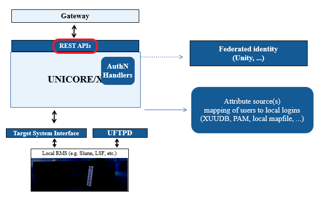

.. _rest-api:

|api-img| REST API
******************

This document describes and documents the REST APIs for the :ref:`UNICORE/X <unicorex>` server (job 
submission and management, data access and data transfer) and the :ref:`Workflow <workflow>` server 
(workflow submission and management).

The documentation generally refers to the latest released version. 

A `Python client library <https://github.com/HumanBrainProject/pyunicore/>`_ 
is under development on GitHub and can be installed from PyPI via
``pip install pyunicore``.

Also, have a look at :ref:`rest-api-examples` for some examples using PyUNICORE.

Basics
------

The REST API supports both the JSON (*application/json*) and HTML (*text/html*) content types.

Base URL
~~~~~~~~

The base URL of the the REST API for a single UNICORE/X server is
:file:`https://{gateway_url}/{SITENAME}/rest/core`.

In the following, we will abbreviate this URL as ``BASE``.

Authentication
~~~~~~~~~~~~~~

You need a user account on the :ref:`UNICORE/X <unicorex>` server, which is typically configured to 
use a `password <password-auth>` 
(or using an `OAuth2 bearer token <oauth2-bearer-token>`). 
The supported `authentication methods 
<auth-img-authentication>` depend on the UNICORE server.

For example, when username/password are enabled you can use ``curl`` to access the base URL above:

.. code:: console

 $ curl -k -u user:pass -X GET -H "Accept: application/json" BASE

In the following examples, we leave out the authentication details!

User preferences
~~~~~~~~~~~~~~~~

In some special cases, you as a user might have more than one available unix account, or you might
have more than just the *user* role on the server. It is possible to select from the available
attributes. Available attributes are: ``role``, ``uid``, ``group``.

For example, to execute a call using the Unix ID *some.user*, you can specify this in a HTTP 
header as follows:

.. code:: console

 $  curl -k -u user:pass -X GET -H "Accept: application/json"  \
        -H "X-UNICORE-User-Preferences: uid:some.user" BASE

Or, to select role *admin* (if you are worthy):

.. code:: console

 $  curl -k -u user:pass -X GET -H "Accept: application/json"  \
        -H "X-UNICORE-User-Preferences: role:admin" BASE

You can find out the available values for these attributes with a ``GET`` to the ``BASE`` URL!

To give more than one user preference, you can separate the values via commas, for example:

.. code:: console

 $  curl -k -u user:pass -X GET -H "Accept: application/json"  \
        -H "X-UNICORE-User-Preferences: uid:myuser,group:mygroup" BASE

Security session handling
~~~~~~~~~~~~~~~~~~~~~~~~~

If authentication was successful, the server reply will include a security session ID and a 
security session lifetime as HTTP headers:
::

 X-UNICORE-SecuritySession: ....
 X-UNICORE-SecuritySession-Lifetime: ...

The lifetime is given in milliseconds.

You can use the session ID in place of authentication info, i.e.

.. code:: console

 $ curl -k -H "X-UNICORE-SecuritySession: ..." BASE

If the session is no longer valid the server will reply with a ``HTTP 432`` error code, and you 
must re-send the authentication information.

Using security sessions is recommend especially when third-party IdPs for used for authentication, 
because it reduces the load on the servers and improves throughput and turnaround time for your
API requests.

General API features
--------------------

A few common operations and principles apply to all the REST resources.

- ``GET`` is used to retrieve information (resource properties).
  Depending on the ``Accept:`` header the format can be JSON or HTML (**JSON is recommended!**).
- ``PUT`` is used to modify resource properties (JSON format).
- ``POST`` creates new resources (e.g. job submission). The URL of new resource is returned in 
  the response ``Location`` header. Some resources support ``POST`` also for triggering actions 
  (e.g., *job abort*).
- ``DELETE`` removes resources.

Media types
~~~~~~~~~~~

The REST API uses the following media types:

- ``application/json`` is the commonly used media type for all sorts of tasks.
- ``application/octet-stream`` : used for upload/download of file data.

Make sure to add the proper headers e.g. ``Accept: application/json`` and/or ``Content-Type: 
application/json`` to your messages.

Error handling
~~~~~~~~~~~~~~

As usual, a HTTP error code that is not in the *2xx* range signifies some sort of problem. For 
example,

- ``401 Unauthorized`` - your credentials are wrong or you do not have the right to access
- ``404 Not found`` - the resource does exist, or you have a typo in the URL
- ``500 Internal server error`` - a server-side error occurred

In many cases a JSON document containing an error message is returned.

Paging mechanism, using tags and controlling the output
~~~~~~~~~~~~~~~~~~~~~~~~~~~~~~~~~~~~~~~~~~~~~~~~~~~~~~~

Since lists of things can get long (e.g. files or jobs), there is a paging mechanism that is 
available on all the *list-like* things like job lists.

Let's look at an example. To list 5 jobs starting at an offset of 2, you'd do a GET for
::

 BASE/sites/{id}/jobs?offset=2&num=5

The result would be something like:
::

	{
	  "_links": {
		"self": {
			"href": "BASE/sites/4q0b44VfBP2/jobs?offset=2&num=5"
		},
		"next": {
			"href": "BASE/sites/4q0b44VfBP2/jobs?offset=7&num=5"
		},
		"previous": {
			"href": "BASE/sites/4q0b44VfBP2/jobs?offset=0&num=5"
		}
	  },
	  "jobs": [
		"BASE/jobs/DZBiAG5O0kH",
		... rest of job URLs omitted ...
	  ]
	}

Note that you get links to the next and previous *page* of results.

Another query parameter is ``tags`` which works on all lists of resources (jobs, storages, ... 
but not files) and which allows you to limit results to those elements that have the specified 
tag(s).
::

 BASE/sites/{id}/jobs/?tags="hpc,test"

Last not least you can control which fields you want in the output of a GET request. This is done 
via another query parameter ``fields`` which works on all resources (jobs, storages, ...) and
which allows you to limit results to the named fields.
::

 BASE/sites/{id}/jobs/DZBiAG5O0kH?fields=status

.. table::
 :widths: 20, 35, 45
 :class: tight-table
 
 +----------+------------------------+--------------------------------------+
 |Parameter |Format                  | Description                          |
 +==========+========================+======================================+
 |offset    |integer (0, 1, 2, ...)  |How many elements of the list to skip |
 +----------+------------------------+--------------------------------------+
 |num       |integer (0, 1, 2, ...)  |How many elements you want            |
 +----------+------------------------+--------------------------------------+
 |tags      |comma-separated strings |Only list elements with this tag      |
 +----------+------------------------+--------------------------------------+
 |fields    |comma-separated strings |Only return the named properties      |
 +----------+------------------------+--------------------------------------+

Modifying resource properties
~~~~~~~~~~~~~~~~~~~~~~~~~~~~~

Resource properties can be modified by a PUT request in JSON format, which contains the properties 
and their new values, e.g.

.. code:: json

 {
   "tags": ["test", "hpc" ],
   "foo" : "bar"
 }

to modify the umask of a storage. The server replies with a JSON indicating which properties were 
modified, or if errors occurred:

.. code:: json

	{
	  "foo": "Property not found or cannot be modified!",
	  "tags": "OK"
	}

REST resources for jobs and data management
-------------------------------------------

The base URL of the the REST API for a single UNICORE/X server is
``https://gateway_url/SITENAME/rest/core``.

.. include:: tables/rsc-jobs-data.rest
  
Synopsis
~~~~~~~~

A ``GET`` request to the base URL retrieves some information about the current client, e.g. its 
security attributes. Also, links to the other resources (sites, jobs, etc) are given, as well as 
some information about the server.

API Summary
~~~~~~~~~~~

.. include:: tables/jobs-data-api.rest

Site factories
~~~~~~~~~~~~~~

Synopsis
^^^^^^^^

In UNICORE there are several *factory services* that are used to get general site information even 
as a non-authorized (but authenticated) user.

The ``factories`` resource is used to access the target system factory services available to the user 
and create new site resources.

API Summary
^^^^^^^^^^^

.. include:: tables/site-factories-api.rest

Site properties
^^^^^^^^^^^^^^^

A site factory exposes its capablilities (number of CPUs, etc) via its JSON or HTML 
representation. This includes the applications that are configured in the UNICORE server's IDB 
file.

Applications are listed in the form
::

 NAME---vVERSION

e.g.
::

 Date---v1.0

You can access more details about an application at the URL
::

 BASE/factories/{id}/applications/{applicationID}

where the application ID is again composed of the application name and version as above.

Sites
~~~~~

Synopsis
^^^^^^^^

The sites resource is used to access the target system services available to the user, create new 
ones, and to submit jobs.

Creating a site
^^^^^^^^^^^^^^^

Using POST, a new site resource can be created.

.. code:: console

 $ curl -X POST -H "Content-Type: application/json" --data "{}"  https://localhost:8080/DEMO-SITE/rest/core/sites

Note that if necessary, a *default* site is created automatically when you submit a job.

Site properties
^^^^^^^^^^^^^^^

A site exposes its capabilities (number of CPUs, etc) via its JSON or HTML representation. This 
includes the applications that are configured in the UNICORE server's IDB file.

Applications are listed in the form
::

 NAME---vVERSION

e.g.
::

 Date---v1.0

You can access more details about an application at the URL
::

 BASE/sites/{id}/applications/{applicationID}

where the *application ID* is again composed of the application name and version as above.

Listing jobs
^^^^^^^^^^^^

You can list all the jobs submitted to a site using the ``BASE/sites/{id}/jobs`` endpoint, by doing 
a GET for
::

 BASE/sites/{id}/jobs

Usually it is simpler to use the ``BASE/jobs`` endpoint.

API Summary
^^^^^^^^^^^

.. include:: tables/list-jobs-api.rest

Storages and files
~~~~~~~~~~~~~~~~~~

Synopsis
^^^^^^^^

The storages resource is used to access the storages available to the user, create new ones, 
access files, and initiate file transfers. Storages may support metadata management as well 
(depending on server configuration).

Listing storages
^^^^^^^^^^^^^^^^

To get a list of storages accessible to you, simply do a ``GET`` for ``BASE/storages``.

Each storage has a ``files`` subresource which is used for accessing files on a particular
storage.

To list files on a storage with id {id}, do a ``GET`` for ``BASE/storages/{id}/files/{filePath}``.

The same way as for jobs, there is a paging mechanism.

Data upload and download
^^^^^^^^^^^^^^^^^^^^^^^^

There are two ways to transfer data to/from a UNICORE storage via the REST API. The simpler, more 
RESTful way is to use ``HTTP GET`` and ``PUT`` requests to download or upload data. This should be 
straightforward, the only thing to note is to NOT use the media type ``application/json``, which 
is reserved for getting information about the file or changing properties.

For example, let's download a file named stdout using ``curl``:

.. code:: console

 $ curl -X GET BASE/storages/{id}/files/stdout

The GET supports the ``Range`` header, if you want to download only part of the file. For example,

.. code:: console

 $ curl -X GET -H "Range: bytes=10-42" ....

You can also get the "tail" of the file, e.g. to get the last 100 bytes

.. code:: console

 $ curl -X GET -H "Range: bytes=-100" ....

Similarly, to upload a file localfile to a remote file newfile:

.. code:: console

 $ curl -X PUT --data-binary @localfile BASE/storages/{id}/files/some_dir/newfile

.. note::
 Any required parent directories will be created automatically.

.. attention::
 There is a special feature related to the ``Content-Type`` header here. If the 
 :ref:`UNICORE/X <unicorex>` server is setup with metadata support, the value of the 
 ``Content-Type`` header will be stored in the file's metadata. If you download the file later, 
 the correct ``Content-Type`` will be used. This will work nicely and automatically for every 
 media type EXCEPT ``application/json``! See the :ref:`rest-api-examples` for a detailed example.

The second way is to create a UNICORE file transfer by POSTing to the ``/imports`` or ``/exports`` 
path, which requires custom clients, e.g. to support :ref:`UFTP 
<uftp-docs:uftp-client>`. For 
this reason, we do not consider this any further here.

Creating directories
^^^^^^^^^^^^^^^^^^^^

If you want to create an empty directory, ``POST`` an empty JSON to
``BASE/storages/{id}/files/{filePath}``.

Copying and renaming data to the same storage
^^^^^^^^^^^^^^^^^^^^^^^^^^^^^^^^^^^^^^^^^^^^^

Copy and rename on the same storage is done by POSTing a JSON to specific *action URLs*. 
The content of the JSON is

.. code:: json

 {"from": "source", "to": "target" }

and the URLs are
::

 BASE/storages/{id}/actions/copy
 BASE/storages/{id}/actions/rename

Copying data to another server
^^^^^^^^^^^^^^^^^^^^^^^^^^^^^^

UNICORE supports server-to-server transfers using one of several protocols including the rather 
efficient :ref:`UFTP protocol <uftp-docs:uftp-docs>`. This is initiated by POSTing to a 
storage resource's/transfers path ``BASE/storages/{id}/transfers``.

The transfer is described using JSON, and can be either ``push`` or ``pull``.

.. include:: tables/copy-to-server.rest

Note that to push data from a storage, you'd use the file and target parameters,
while for data pull, you need the file and source.

For example, to pull a file via UFTP, you would POST a JSON that looks something like this::

 {
    file: "localFile.txt",
    source: "UFTP:https://somehost/SITE/rest/core/storages/{id}/files/path_to_file"
    extraParameters: {
      "uftp.compression" : true,
    }
 }

You can also schedule the transfer, by using
::

 scheduledStartTime: <TIME in ISO "yyyy-MM-dd'T'HH:mm:ssZ" format>

as one of the *extraParameter* settings.

Files and metadata
^^^^^^^^^^^^^^^^^^

Files on a storage are accessed via the ``files`` subresource, e.g.
::

 BASE/storages/tmp/files/test.txt

would access the file *test.txt* on the storage with id *tmp*.

Depending on the media type used, GET and PUT fulfill different functions.
Using JSON, the file's properties can be accessed or modified. Using 
``application/octet-stream`` the actual binary file data can be downloaded or uploaded.

The file properties include metadata, which can also be modified (if the server is configured so 
that metadata is supported).

Searching the metadata index
++++++++++++++++++++++++++++

If the storage supports metadata, the index can be searched using a ``GET`` request as follows:

.. code:: console

 $ curl -H "Accept: application/json" BASE/storages/{id}/search?q=querystring

The query string is appended as the ``?q=...`` URL query parameter. The server will reply
with a JSON listing the files found::

	{
	  "status": "OK",
	  "numberOfResults": 2,
	  "_links": {
		"search-result-1": {
			"href": "https://..."
		},
		"search-result-2": {
			"href": "https://..."
		},
		...
	  },
	  "query": "query-string"
	}

Triggering the automated metadata extraction
++++++++++++++++++++++++++++++++++++++++++++

Triggering UNICORE's metadata extraction is done by a ``POST`` to an action URL for
a file or a directory.

.. code:: console

 $ curl -X POST BASE/storages/{id}/files/some_directory/actions/extract --data-binary @params.json -H "Content-Type: application/json"

This would extract metadata from the files in the *some_directory* directory.

The POSTed JSON can be empty ``{}``, or it may contain extra parameters controlling the extraction 
process. Currently only a single parameter is supported, which controls the recursion depth for 
the extraction process, e.g.

.. code:: json

	{
	  "depth": "2"
	}

API Summary
^^^^^^^^^^^

.. include:: tables/storages-files-api.rest

Storage factories
~~~~~~~~~~~~~~~~~

Synopsis
^^^^^^^^

Storage factory endpoints allow the user to create Storage instances. Depending on the
UNICORE server configuration there may be several types of Storages available, which may
accept parameters to configure them.

The ``storagefactories`` resource is used to access the storage factory services available
to the user, which then can be used to create new Storage endpoints.

These Storage endpoints are typically used as temporary resources, since they will eventually
get cleaned up automatically by the server.

Creating storages
^^^^^^^^^^^^^^^^^
To create a Storage, you would POST to the appropriate endpoint:

.. code:: console

 $ curl -X POST BASE/storages/default_storage_factory --data-binary @params.json -H "Content-Type: application/json"

The POSTed JSON can be empty ``{}``, which will create a Storage pointing to some pre-configured directory
on the HPC file system.

It may contain extra parameters controlling the type of storage that is created, and also extra parameters
depending on the type. You can get more information about the possible types and parameters by
inspecting the properties of the ``storagefactories`` endpoint, and the properties of the
actual factories that are configured.

For example, the ``storagefactories/default_storage_factory`` endpoint supports a 'path' parameter, which controls
the path the new Storage should access.

.. code:: json

	{
	  "path": "/opt/data/"
	}

API Summary
^^^^^^^^^^^

.. include:: tables/storage-factories-api.rest

Jobs
~~~~

Synopsis
^^^^^^^^

The jobs resource ist used to access the jobs available to the user, to monitor and manage them. 
It is also possible to submit new jobs.

Job description format
^^^^^^^^^^^^^^^^^^^^^^

The job description is described :ref:`here <job-description>`.

Data management
^^^^^^^^^^^^^^^

The job description can contain data staging instructions for instructing the server to download 
input data before running the job, and for uploading results to some remote location when the job 
is done.

In addition, UNICORE supports client-controlled data staging, i.e. the client can optionally 
upload required data to the job's working directory. You can interact with the jobs working 
directory, which is a normal UNICORE storage. Thus all the storage functions above are applicable 
here as well.

In case you do want to upload any data, you can set an additional flag in the job description 
JSON:

.. code:: json

	{
	 "haveClientStageIn": "true",
	}

In this case, the full job submission sequence is:

#. submit job
#. upload data from client to server
#. start job

Note however that **small(!)** files can be embedded into the job description as well.

In the :ref:`rest-api-examples` you will find some typical job submission and management examples.

Starting, aborting or restarting jobs
^^^^^^^^^^^^^^^^^^^^^^^^^^^^^^^^^^^^^

To abort or restart a job, the REST API uses POST requests to special *action* links, see the API 
summary below.

API Summary
^^^^^^^^^^^

.. include:: tables/jobs-api.rest

Job properties
^^^^^^^^^^^^^^

To get information about a job, do a ``GET`` request to the ``/jobs/ID`` endpoint.

.. include:: tables/job-props.rest

Transfers
~~~~~~~~~

Synopsis
^^^^^^^^

The ``transfers`` resource ist used to access the server-to-server file transfers available to the 
user, to monitor and manage them.

API Summary
^^^^^^^^^^^

.. include:: tables/transfers-api.rest

..
 .. csv-table::
  :file: tables/transfers-api.csv
  :widths: 30, 20, 50
  :header-rows: 1
  :class: tight-table

Workflow
~~~~~~~~

Synopsis
^^^^^^^^

The :ref:`UNICORE Workflow system <workflow>` can be accessed for workflow submission and management.

Basics like authentication, user preferences, security sessions work the exact same way as for a 
UNICORE/X server.

NOTE that the BASE url for workflows is:

:file:`https://{gateway_url}/{WORKFLOW_SITENAME}/rest/workflows`

This base *workflows* URL is used to list the workflows available to the user and submit new
ones.

API Summary
^^^^^^^^^^^

.. include:: tables/workflow-api.rest

Workflow submission
^^^^^^^^^^^^^^^^^^^

Submitting a workflow is done with a single ``POST`` with ``Content-Type: application/json`` 
to the base URL.

If successful, a new workflow instance will be created, and the URL returned in a HTTP location 
header.

If the workflow contains errors, the response body will contain a list of errors.

Workflow description format
^^^^^^^^^^^^^^^^^^^^^^^^^^^

The JSON workflow description as understood by the :ref:`Workflow engine <workflow>` is described here: 
:ref:`workflow-description`.

Workflow properties
^^^^^^^^^^^^^^^^^^^^

For each workflow, a ``GET`` request will retrieve a representation of the current workflow state, 
including the current state of the workflow variables.

To get a list of jobs that were submitted for the workflow, do a ``GET`` request to 
``BASE/{id}/jobs``.

To get a list of workflow files (registered names and physical locations) for the workflow, do a 
``GET`` request to ``BASE/{id}/files``.

Hold and resume
^^^^^^^^^^^^^^^

A workflow in *held* state (``waiting for user input``) can be resumed by a ``POST`` to the URL
``BASE/{id}/actions/resume`` with JSON content. The JSON can contain new values for any workflow 
variables, e.g.

.. code:: json

	{
	"Variable1": "10",
	"Variable2": "true",
	}

Utility endpoints
-----------------

Getting the server certificate
~~~~~~~~~~~~~~~~~~~~~~~~~~~~~~

A GET request to ``BASE/certificate`` will retrieve the server's certificate in PEM format

.. code:: console

 $  curl -k BASE/certificate
 -----BEGIN CERTIFICATE-----
 MIIC3j...
 -----END CERTIFICATE-----

Creating a token
~~~~~~~~~~~~~~~~

The GET request to endpoint ``BASE/token`` allows you to create a JWT token signed by the server, that
can be used for authentication later. For example, this can be very useful for automation tasks,
where you don't want to put a potentially sensitive password into a script.
In this case you would create an authentication token and use that for the automation task.

.. code:: console

 $  curl -k BASE/token
 eyJh...

The token will of course only give the same level of authentication that was used when creating it!

The endpoint accepts parameters as query parameters to the GET request

 * ``lifetime`` token lifetime in seconds. If not set, the server's default is used (usually 300 seconds)
 * ``limited=true`` will make the token only valid for the UNICORE/X server that you got it from
 * ``renewable=true`` will allow to get new tokens using the issued token 
 
For example

.. code:: console

 $  curl -k -u demouser:test123 "BASE/token?lifetime=3600&limited=true&renewable=true"
 eyJh...

Examples and HowTos
-------------------

Can be found here :ref:`rest-api-examples`.

.. toctree::
	:maxdepth: 2
	:hidden:

	rest-api-examples.rst